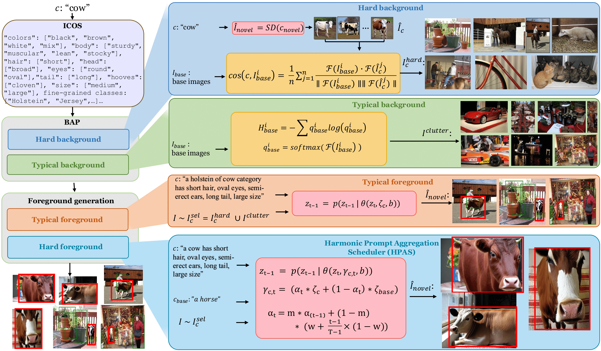

# MPAD: Multi-Perspective Augmentation for Few-Shot Object Detection

[](https://opensource.org/licenses/MIT)
[](https://openreview.net/forum?id=qG0WCAhZE0)
<!-- [](https://www.python.org/downloads/) -->

Official implementation of [**MPAD**: Multi-Perspective Augmentation for Few-Shot Object Detection](https://openreview.net/forum?id=qG0WCAhZE0). *Accepted at International Conference on Learning Representations (ICLR) 2025*.

  
*Figure: MPAD's multi-perspective augmentation pipeline.*

<!-- ## Table of Contents
- [Key Features](#-key-features)
- [Installation](#-installation)
- [Usage](#-usage)
- [Results](#-results)
- [Release Plan](#-release-plan)
- [Citation](#-citation)
- [Contributing](#-contributing)
- [License](#-license)
 -->
## 📌 Key Features
✔ **Diffusion-Driven Augmentation**: Uses [PowerPaint](https://github.com/open-mmlab/PowerPaint) to generate photorealistic multi-perspective images.  
✔ **Few-Shot Object Detection Optimization**: Boosts average MS COCO by **+11.5 nAP50** over [DeFRCN](https://github.com/er-muyue/DeFRCN) baselines.  

## 🚀 Installation

<!-- ### Prerequisites
- NVIDIA GPU with CUDA 11.3+
- Python 3.8+
 -->
 
1. Clone Repository
```bash
git clone https://github.com/nvakhoa/MPAD.git
cd MPAD
```

2. Install PowerPaint (see `mpad_generation/PowerPaint/README.md`)


## 🛠️ Usage

### 🏗️ Pre-trained Weights Setup

To run MPAD, you'll need to download the following pre-trained weights and place them in `mpad_generation/utils/metadata.py`:

1. Stable Diffusion Models

Download these foundational models from Hugging Face at [here](https://huggingface.co/stable-diffusion-v1-5):
```python
# Stable Diffusion Inpainting
stable_inpaint_path = 'mpad_generation/PowerPaint/models/stable-diffusion-inpainting'
# Download from: https://huggingface.co/stable-diffusion-v1-5/stable-diffusion-inpainting

# Stable Diffusion v1.5
stable_diffusion_path = 'mpad_generation/PowerPaint/models/stable-diffusion-v1-5'
# Download from: https://huggingface.co/stable-diffusion-v1-5/stable-diffusion-v1-5
```
2. PowerPaint Weights

Download the specialized PowerPaint components at [here](https://huggingface.co/JunhaoZhuang/PowerPaint-v1/tree/main):
```python
# UNet model
unet_path = "mpad_generation/PowerPaint/models/unet/unet.safetensors"
# Text Encoder
text_encoder_path = "mpad_generation/PowerPaint/models/text_encoder/text_encoder.safetensors"
# Download both from: https://huggingface.co/JunhaoZhuang/PowerPaint-v1/tree/main
```
3. Pre-processed Features
Download the extracted features for novel class synthesis at [here](https://drive.google.com/file/d/1DCiLXICXqVqrFd675DXGpC-jib2O2Pa7/view?usp=sharing):
```python
feature_dir = "mpad_generation/NovelClassSynthesis"
# Download from: https://drive.google.com/file/d/1DCiLXICXqVqrFd675DXGpC-jib2O2Pa7/view?usp=sharing
```

### Data Preparation

Organize your dataset like FSOD set-up:

```
datasets/
├── VOC2007/
│   ├── Annotations/
│   └── ImageSets/
│   └── JPEGImages/
├── VOC2012/
│   ├── Annotations/
│   └── ImageSets/
│   └── JPEGImages/
├── annotations/
└── coco/
    ├── trainval2014/
    └── val2014/
    
```
### Generate Augmented Data
```bash
bash generate.sh
```
### FSOD training (comming soon)

## Results
### Generalized Few-shot Object Detection Results (nAP50) on VOC


 Method                          | |       |   Novel Set 1     |       |       | |       |    Novel Set 2   |       |       | |       |     Novel Set 3 (nAP50)   |       |       | Mean |
|---------------------------------|-------|-------|-------|-------|-------|-------|-------|-------|-------|-------|-------|-------|-------|-------|-------|------|
|shot| 1-shot | 2-shot | 3-shot | 5-shot | 10-shot | 1-shot | 2-shot | 3-shot | 5-shot | 10-shot | 1-shot | 2-shot | 3-shot | 5-shot | 10-shot |      |
| [TIP](https://openaccess.thecvf.com/content/CVPR2021/papers/Li_Transformation_Invariant_Few-Shot_Object_Detection_CVPR_2021_paper.pdf)                             | 27.7 | 36.5 | 43.3 | 50.2 | 59.6 | 22.7 | 30.1 | 33.8 | 40.9 | 46.9 | 21.7 | 30.6 | 38.1 | 44.5 | 50.9 | 38.5 |
| [Halluc](https://openaccess.thecvf.com/content/CVPR2021/papers/Zhang_Hallucination_Improves_Few-Shot_Object_Detection_CVPR_2021_paper.pdf) | 47.0 | 44.9 | 46.5 | 54.7 | 54.7 | 26.3 | 31.8 | 37.4 | 37.4 | 41.2 | 40.4 | 42.1 | 43.3 | 51.4 | 49.6 | 43.2 |
| [LVC](https://openaccess.thecvf.com/content/CVPR2022/papers/Kaul_Label_Verify_Correct_A_Simple_Few_Shot_Object_Detection_Method_CVPR_2022_paper.pdf)| 54.5 | 53.2 | 58.8 | 63.2 | 65.7 | 28.8 | 29.2 | 50.7 | 49.8 | 50.6 | 48.4 | 52.7 | 55.9 | 59.6 | 59.6 | 53.3 |
|[Norm-VAE](https://openaccess.thecvf.com/content/CVPR2023/papers/Xu_Generating_Features_With_Increased_Crop-Related_Diversity_for_Few-Shot_Object_Detection_CVPR_2023_paper.pdf) | 62.1 | 64.9 | 67.8 | 69.2 | 67.5 | 39.9 | 46.8 | 54.4 | 54.2 | 53.6 | 58.2 | 60.3 | 61.0 | 64.0 | 65.5 | 59.3 |
| [SFOT](https://arxiv.org/pdf/2308.15005) || 47.9 | 60.4 | 62.7 | 67.3 | 69.1 | 32.4 | 41.2 | 45.7 | 50.2 | 54.0 | 43.5 | 54.1 | 56.9 | 60.6 | 62.5 | 53.9 |
| [Lin et al.](https://openaccess.thecvf.com/content/CVPR2023W/GCV/papers/Lin_Explore_the_Power_of_Synthetic_Data_on_Few-Shot_Object_Detection_CVPRW_2023_paper.pdf)                     | 67.5 | -    | 69.8 | 71.1 | 71.5 | 52.0 | -    | 54.3 | 57.5 | 57.4 | 55.9 | -    | 58.6 | 59.6 | 63.9 | 61.6 |
| [SNIDA](https://openaccess.thecvf.com/content/CVPR2024/papers/Wang_SNIDA_Unlocking_Few-Shot_Object_Detection_with_Non-linear_Semantic_Decoupling_Augmentation_CVPR_2024_paper.pdf)| 59.3 | 60.8 | 64.3 | 65.4 | 65.6 | 35.2 | 40.8 | 50.2 | 54.6 | 50.0 | 51.6 | 52.4 | 55.9 | 58.5 | 62.6 | 55.1 |
| [**MPAD (Ours)**](https://arxiv.org/abs/2502.18195)                  | **69.1** | **69.5** | **69.6** | **69.9** | **68.9** | **58.4** | **59.7** | **61.8** | **61.8** | **63.5** | **70.1** | **69.8** | **69.9**  | **70.4** |  **71.4** | **66.9** |
### Generalized Few-shot Object Detection Results on COCO


| Shot                          | | 1 | |   | 2 |  |   | 3 |  |  | 5 |  |
|---------------------------------|-----------|-------|-------|-----------|-------|-------|-----------|-------|-------|-----------|-------|-------|
| Method                          | nAP | nAP50 | nAP75 |  nAP | nAP50 | nAP75 |  nAP | nAP50 | nAP75 | nAP | nAP50 | nAP75 |
| [Halluc](https://openaccess.thecvf.com/content/CVPR2021/papers/Zhang_Hallucination_Improves_Few-Shot_Object_Detection_CVPR_2021_paper.pdf)     | 4.4       | 7.5   | 4.9   | 5.6       | 9.9   | 5.9   | 7.2       | 13.3  | 7.4   | -         | -     | -     |
| [SFOT](https://arxiv.org/pdf/2308.15005) | 6.7       | 13.2  | 6.0   | 10.5      | 20.3  | 9.7   | 12.5      | 23.6  | 11.8  | 14.9      | 27.8  | 14.2  |
| [Norm-VAE](https://openaccess.thecvf.com/content/CVPR2023/papers/Xu_Generating_Features_With_Increased_Crop-Related_Diversity_for_Few-Shot_Object_Detection_CVPR_2023_paper.pdf)     | 9.5       | -     | 8.8   | 13.7      | -     | 13.7  | 14.3      | -     | 14.4  | 15.9      | -     | 15.3  |
| [SNIDA](https://openaccess.thecvf.com/content/CVPR2024/papers/Wang_SNIDA_Unlocking_Few-Shot_Object_Detection_with_Non-linear_Semantic_Decoupling_Augmentation_CVPR_2024_paper.pdf)  | 9.3       | -     | -     | 12.9      | -     | -     | 14.8      | -     | -     | 16.1      | -     | -     |
| [DeFRCN (Baseline)](https://arxiv.org/abs/2108.09017)       | 4.8       | 9.5   | 4.4   | 8.5       | 16.3  | 7.8   | 10.7      | 20.0  | 10.3  | 13.5      | 24.7  | 13.0  |
| [**MPAD (Ours)**](https://arxiv.org/abs/2502.18195)                | **18.3**  | **31.2** | **18.8** | **18.5** | **31.6** | **18.9** | **18.8** | **31.8** | **19.1** | **18.9** | **32.4** | **19.3** |

Training on NVIDIA GeForce RTX 2080 Ti GPU GPUs (11GB)

## Release Plan

| Component         | Status     | Release Date |
|-------------------|------------|--------------|
| Generation Code   | ✅Released | April 2025     |
| FSOD Training Code| 🔜Coming   | Expected: June 2025    |
| Pre-trained Models| 🔜Coming   | Expected: July 2025   |

## Citation
If you use this work in your research or wish to refer to the baseline results published here, please use the following BibTeX entries:
```
@inproceedings{mpad2025,
  title={MPAD: Multi-Perspective Augmentation for Few-Shot Object Detection},
  author={Vu, Anh-Khoa Nguyen and Truong, Quoc-Truong and Nguyen, Vinh-Tiep and Ngo, Thanh Duc and Do, Thanh-Toan and Nguyen, Tam V},
  booktitle={International Conference on Learning Representations (ICLR)},
  year={2025},
  url={https://arxiv.org/abs/2502.18195}
}
```